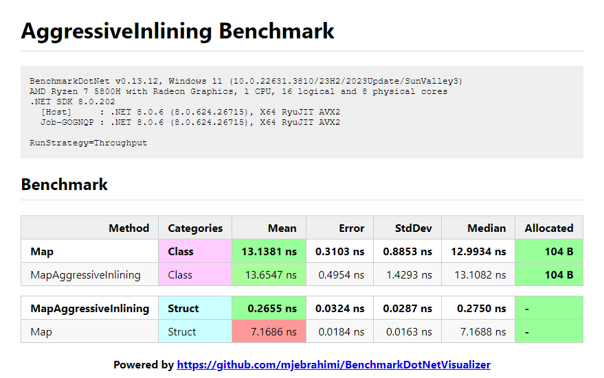

# AggressiveInlining Benchmark

## Key Results

- For `class` the difference between using `[MethodImpl(MethodImplOptions.AggressiveInlining)]` and not using it is negligible.
- But for `struct` using `[MethodImpl(MethodImplOptions.AggressiveInlining)]` is **much faster** (**27x faster** in this case) than without it.

