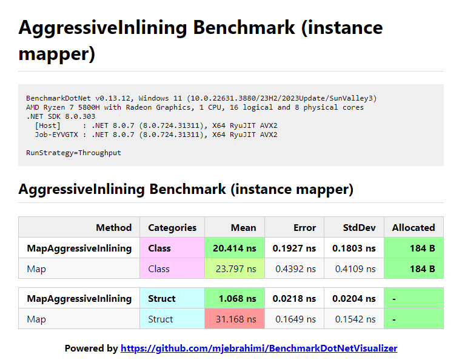

# AggressiveInlining Benchmark

## Key Results

- For `class` the difference between using `[MethodImpl(MethodImplOptions.AggressiveInlining)]` and not using it is negligible.
- But for `struct` using `[MethodImpl(MethodImplOptions.AggressiveInlining)]` is **much faster** (**34x faster** in this case) than without it.
- There is no difference between **static** and **instance** mapper classes in terms of the impact of `AggressiveInlining`.
- Using `AggressiveInlining` **only on top level methods is a bit faster** than not using it **but not as fast as using it on all nested methods** (as the main advantage of `AggressiveInlining` is reducing method calls)

