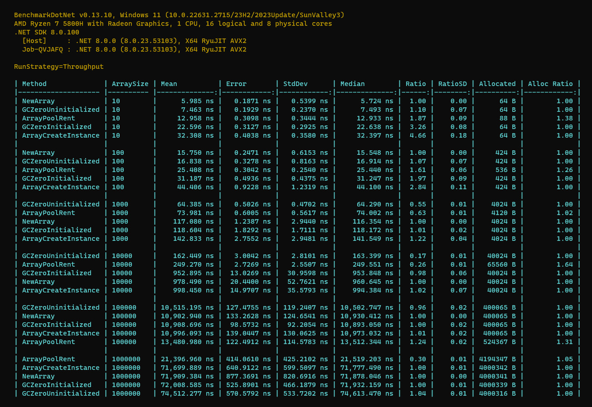

# Different ways to Allocate an Array/[]

## Key Results about `GC.AllocateUninitializedArray`

1. Using `GC.AllocateUninitializedArray` **might performs better than** `new []` because it **skips zero-initialization when it's possible** (in the **worst case** it has the **same performance** as `new []`)
2. Skipping zero-initialization using `GC.AllocateUninitializedArray` only has a material performance benefit for **large arrays**, such as buffers of **several kilobytes or more**. (for example **more than 10_000 array length**)
3. Skipping zero-initialization is a **Security Risk**. The uninitialized array can contain **invalid values** or **sensitive information** created **by other parts of the application**. The code operating on uninitialized arrays should be heavily scrutinized to ensure that the uninitialized data **is never read**.

## Key Results about `ArrayPool<T>.Shared.Rent`

1. Use `ArrayPool<T>.Shared.Rent` when you need a **temporary array**, for example **internal buffer in Streams**.
2. You **Must return it back to the pool** by `ArrayPool<T>.Shared.Return`. (**Don't forget it**)
3. You **Should Not** return ArrayPool rented array from your method for **external using** (because the consumer don't have idea about it's rented and must be returned back to the pool)

**Comparing: `new []` vs `GC.AllocateUninitializedArray`**

## Useful resources

https://steven-giesel.com/blogPost/72f3bada-f6c6-4c06-b6ee-e9ac48cd1c94
https://blog.ladeak.net/posts/gc-allocate-uninitialized

https://learn.microsoft.com/en-us/dotnet/api/system.gc.allocateuninitializedarray?view=net-8.0
https://github.com/dotnet/runtime/discussions/47198
https://github.com/dotnet/runtime/issues/82548
