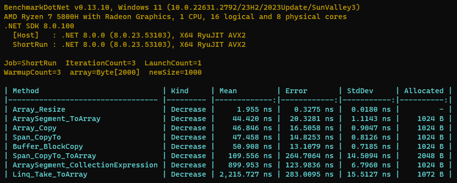

# Different ways to Resize an Array

## Key Results

1. `Array.Resize` the **fastest** one with **zero allocation** (BUT it **just resize** the array and **do NOT create a new array**)
2. These have **similar performance and allocation**
   - Array_CollectionExpression (**NOT** ToArray over it)`array[..length]`
   - RuntimeHelpers_GetSubArray `RuntimeHelpers.GetSubArray(array, ..length)`
   - Array_Copy `Array.Copy(array, newArray, length)`
   - Buffer_BlockCopy `Buffer.BlockCopy(array, 0, newArray, 0, length)`
   - ArraySegment_ToArray (**NOT** additional CollectionExpression) `new ArraySegment<byte>(array, 0, length).ToArray()`
   - Span_Slice_ToArray `((ReadOnlySpan<byte>)array).Slice(0, length).ToArray()`
   - Span_Slice_CopyTo `((ReadOnlySpan<byte>)array).Slice(0, length).CopyTo(newArray)`
   - Span_CollectionExpression_ToArray `((ReadOnlySpan<byte>)array)[..length].ToArray()`
   - Span_CollectionExpression_CopyTo `((ReadOnlySpan<byte>)array)[..length].CopyTo(newArray)`
3. `Linq_Take_ToArray` is **the slowest**

