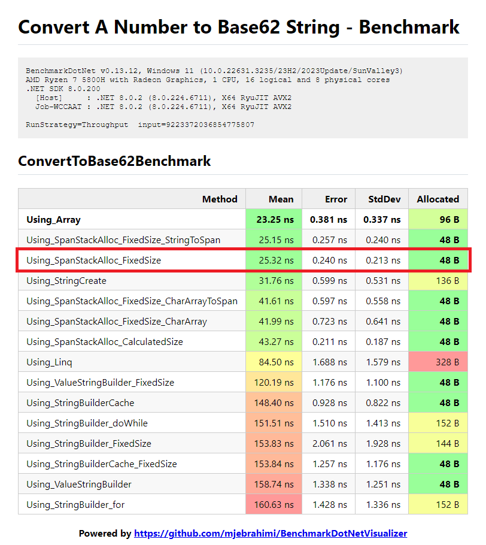

# Different ways to convert a number in Base10 to a string in Base62

## Key Results

- `Using_SpanStackAlloc_FixedSize` is the **Most Efficient** in terms of Speed and Allocation
- Both `Using_Array` and `Using_SpanStackAlloc_FixedSize` has the **Same Speed** but the latter has **Fewer Allocation** (thereby more GC friendly)
- `Using_StringBuilder_doWhile` is **Faster** than `Using_StringBuilder_for`
- `ValueStringBuilder` and `StringBuilderCache` have **Fewer Allocation** (thereby more GC friendly)

