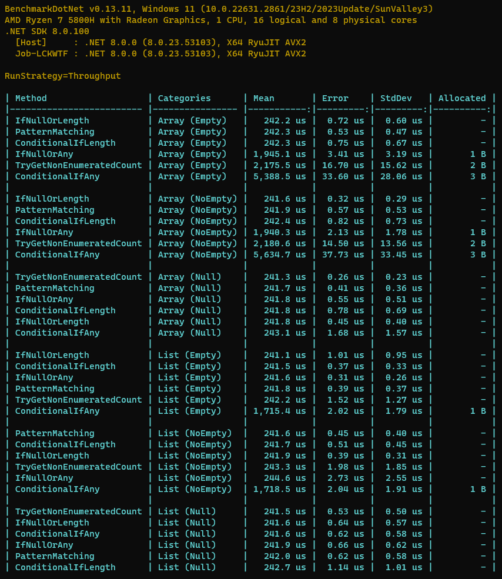
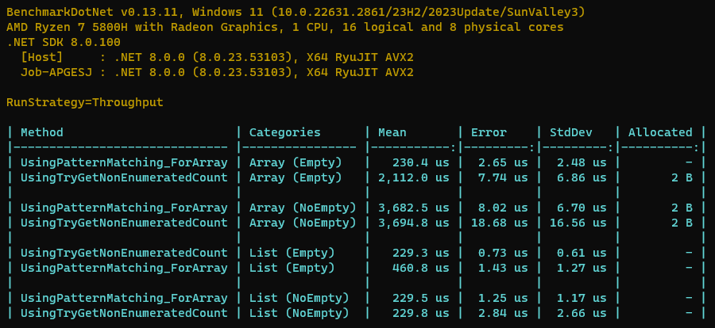

# Different ways to Check NotNullOrEmpty for collections

## Key Results
1. `IfNullOrLength`, `ContitionalIfLength`, and `PatternMatching` have **Similar** performance.
2. Prefer to check by `Length/Count` wherever possible instead of using `Any()` method.
3. Both these methods uses Linq Any **BUT** `collection?.Any() != true` is **Slower** than `collection is null || !collection.Any()` for **not-null** collections
4. For **General (IEnumerable) purpose**, using `TryGetNonEnumerableCount()` is **Faster** than Linq `Any()` method.

**Benchmark2 Key Results:**
1. Using `TryGetNonEnumerableCount()` for **Array** is **Slower than** for **List** (not-null). (***so prefer to use Array PatternMatching at first then check `TryGetNonEnumerableCount()`***)
2. Checking first with pattern matching for Array is **2x slower** for **Non-Array** collections (when are empty) because it has one extra type checking
3. **BUT** it's also about **9x faster** than `TryGetNonEnumerableCount()` for **Array** collections (when are empty). For **null** and **non-empty** collections are **the same**, so it's a **trade-off**.

**Benchmark2**

