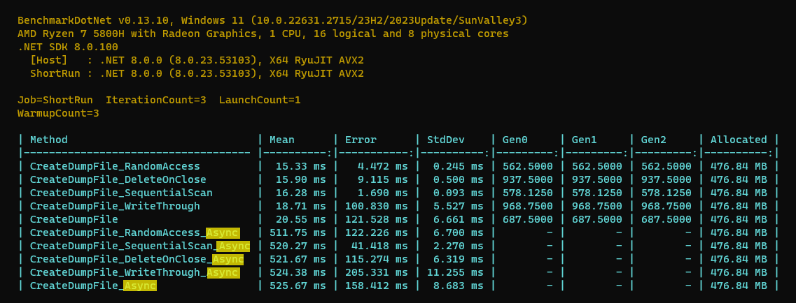
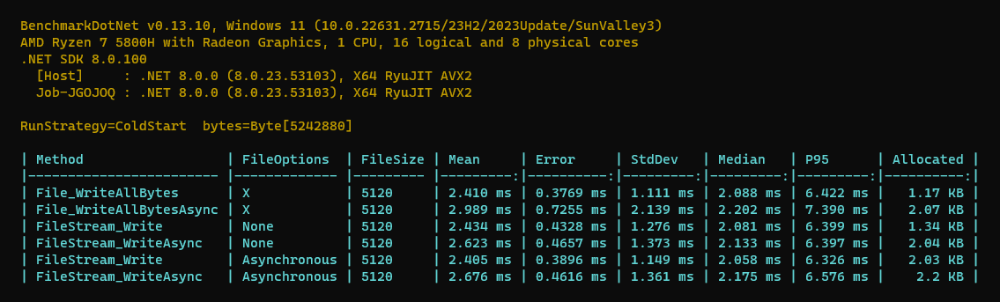

# Different methods to Shuffle a collection

## Key Results

**Sync** methods are significantly **faster** than **Async** methods!

1. `Sync` methods are **a bit Faster** than `Async` methods
2. `FileStream.WriteAsync` with `FileOptions.None` and is **a bit Faster** than `FileOptions.Asynchronous`
3. `File.WriteAllBytes` and `FileStream.Write` with `FileOptions.None` have the **same performance** (in terms of speed) but the first one has **a bit Less allocation**.
3. `File.WriteAllBytesAsync` and `FileStream.WriteAsync` with `FileOptions.None` have the **same performance** (in terms of speed) but the first one has **a bit More allocation**.

