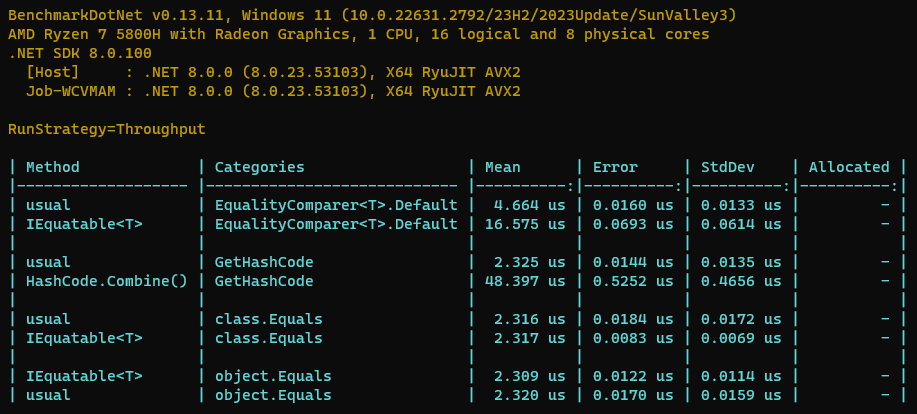
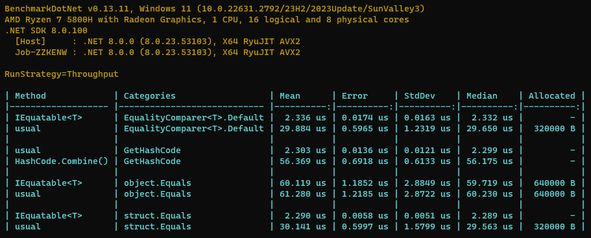

# GetHashCode() and Equals() Benchmark

## Key Results (For Class)

- Overriding `Equals(object obj)` has the **Same** performance as `IEquatable<T>.Equals(T other)`
- But for `EqualityComparer<ClassA>.Default.Equals()`, using `IEquatable<T>.Equals(T other)` is **Slower**. 
- Calculating hash code mathematically is much **Faster** than `HashCode.Combine`.

## Key Results (For Struct)

- `IEquatable<T>.Equals(T other)` is much **Faster** than Overriding `Equals(object obj)`.
- **DO NOT** use `object.Equals()` for structs.

