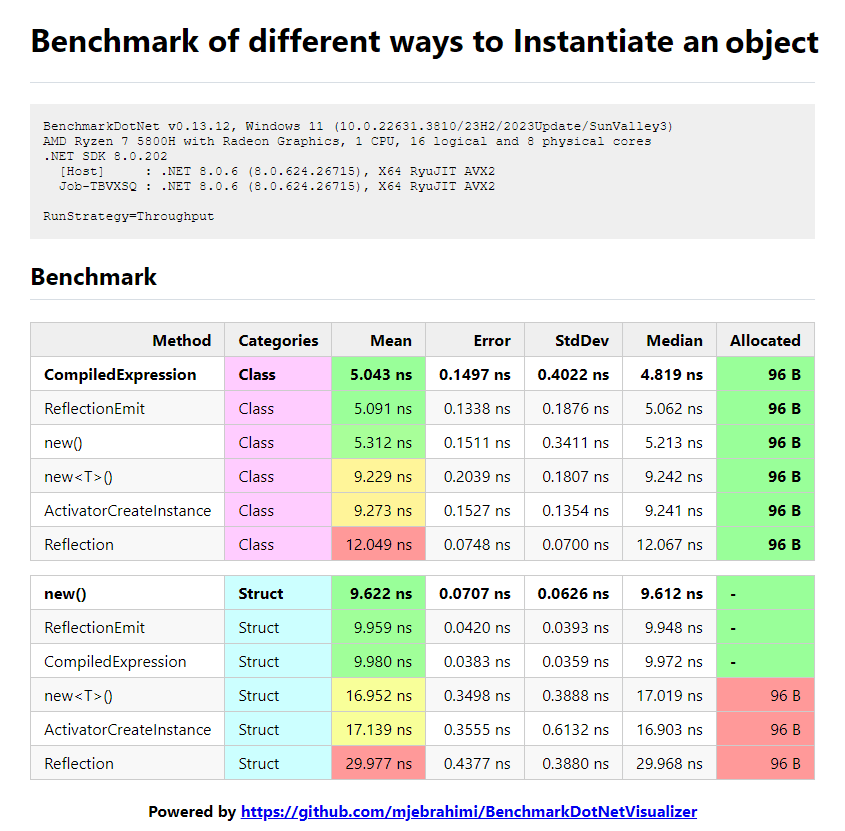

# Benchmark of different ways to Instantiate an object

## Key Results

- `CompiledExpression` (preferable) and `ReflectionEmit` are similar and have **raw performance as** `new`.
- `new T()` **(Generic) is slower** than `new` and performs similar to `Activator.CreateInstance`.
- `CompiledExpression` is preferable over `ReflectionEmit` because of its simplicity and readability. (Also on AOT platforms like Xamarin and Unity that don't support IL emitting at runtime, the lambda expression works because it is executed using an interpreter)

### Lambda Expressions vs Reflection Emit (IL Emitting) on Ahead-of-Time (AOT) platforms such as Xamarin and Unity

https://stackoverflow.com/questions/29245589/why-does-lambdaexpression-compile-work-on-ios-xamarin

On Ahead-of-Time (AOT) platforms such as Xamarin and Unity, where Intermediate Language (IL) emission is not supported, lambda expressions often cannot be fully compiled. Instead, these expressions are typically interpreted at runtime.

Here's a more detailed explanation:

1. **Lambda Expressions and IL**: In .NET, lambda expressions are often compiled into Intermediate Language (IL) code, which can be executed by the Common Language Runtime (CLR). This process involves generating DynamicMethods and IL code on the fly.

2. **AOT Compilation**: AOT platforms like Xamarin (for mobile applications) and Unity (for game development) compile code ahead of time to native code, rather than relying on Just-In-Time (JIT) compilation. This approach is necessary for platforms where JIT compilation is either not available or not desirable for performance reasons.

3. **IL Emit Limitations**: AOT platforms do not support dynamic generation of IL code at runtime. This means that features which rely on IL generation and dynamic method creation, such as dynamic lambda expression compilation, cannot be utilized directly.

4. **Interpreted Execution**: To work around this limitation, AOT platforms typically resort to interpreting lambda expressions. Instead of compiling the expression tree into executable IL, the expression tree is traversed and executed in an interpreted manner at runtime.

In summary, on AOT platforms like Xamarin and Unity, lambda expressions are not compiled into IL and executed directly. Instead, they are interpreted, which can have performance implications compared to fully compiled code.
