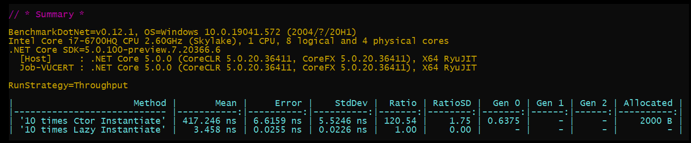

# Ctor Instantiate vs Lazy Instantiate

For 100,000 iteration the results were **Considerable**.

Lazy instantiation was about **120x faster** with **zero allocation**.

This can be very effective, especially when querying entities from the database.

