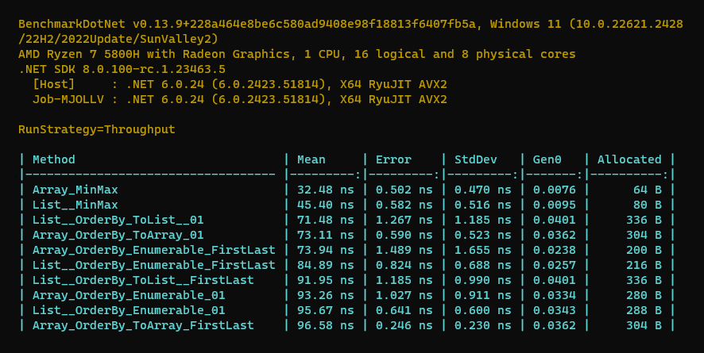

# Different methods to Reverse a string

## Key Results: 
1. `Min()` and `Max()` are **the fastest and most memory efficient** on `Array` and `List`
2. `[0]` and `[1]` are **faster (but same allocation) than** `First()` and `Last()` on `List` and `Array`
3. `First()` and `Last()` are **faster and more memory efficient than** `[0]` and `[1]` on `IEnumerable`
4. Generally working with `Array` is **faster and more memory efficient than** `List` and then `IEnumerable`.

