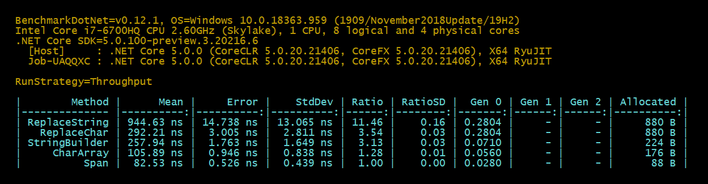

# Replace String Benchmark

### Key Result:

- `ToCharArray` : **Fastest** but 28% (in my test) **more allocation** than string.Create()
- `string.Create` : About the **same speed** but **less allocation** (*string.Create uses Span and applies to .NETStandard 2.1 and above*)

