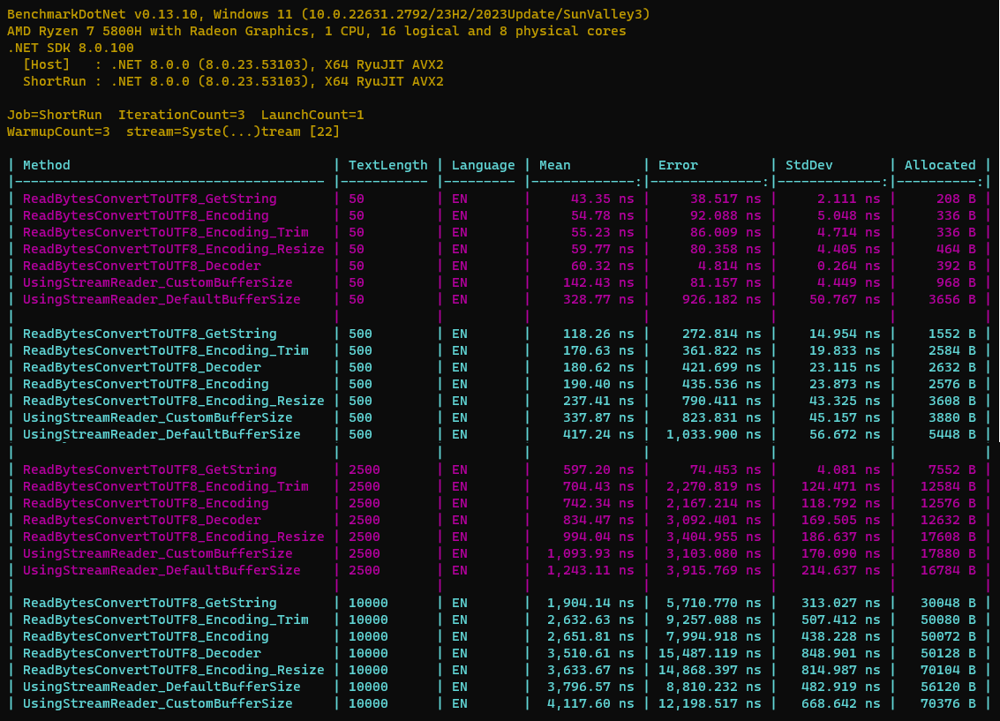
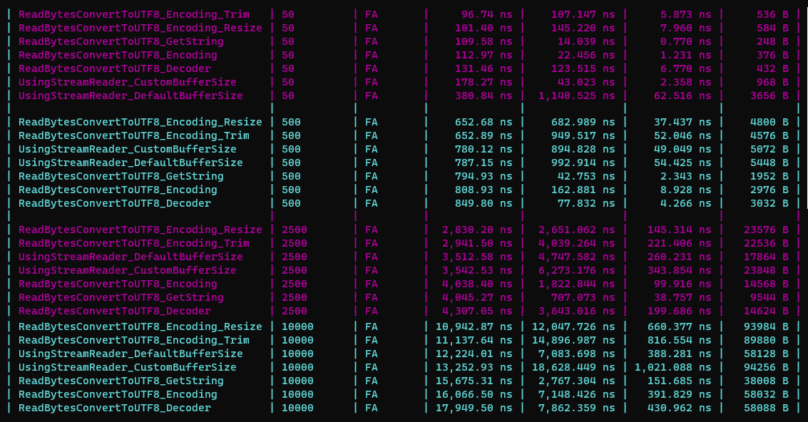
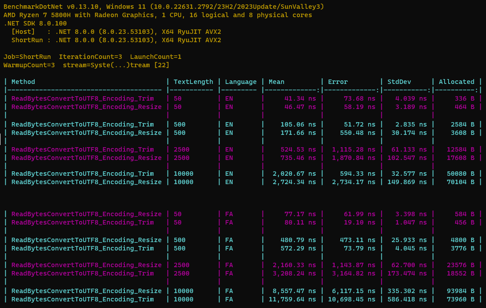

# Different ways to read byte[] from Stream

## Key Results

In general

1. `ReadBytesConvertToUTF8_GetString` has the **least memory allocation**
2. And in terms of performance **speed** it is the **Best** for **English** but **Moderate** for **Farsi**
3. Both `ReadBytesConvertToUTF8_Encoding` and `ReadBytesConvertToUTF8_Decoder` performance and allocation are similar (the second one has a bit more allocation)
4. And they have **Moderate** performance speed and allocation for **English** but the **Worst** for **Farsi**
5. `UsingStreamReader_DefaultBufferSize` with **default buffer size** (DefaultBufferSize = 1024) is **slower** and has **more memory allocation** than `UsingStreamReader_CustomBufferSize` with **specified buffer size** in **small streams** (less than 1024 length)
6. But `UsingStreamReader_DefaultBufferSize` for **large streams** is **faster** and has **less memory allocation** than `UsingStreamReader_CustomBufferSize`
7. `ReadBytesConvertToUTF8_Encoding_Resize` has **more allocation** than others but its performance **speed** is the **Best**  for **Farsi** but **Moderate** for **English**
8. `ReadBytesConvertToUTF8_Encoding_Trim` is **faster** with **less allocation** for **English** (because it requires no trimming) but **slower** with **more allocation** for **Farsi** (because it requires trimming)

**Language: English**

**Language: Farsi**

**ReadBytesConvertToUTF8_Encoding_Trim vs ReadBytesConvertToUTF8_Encoding_Resize**

