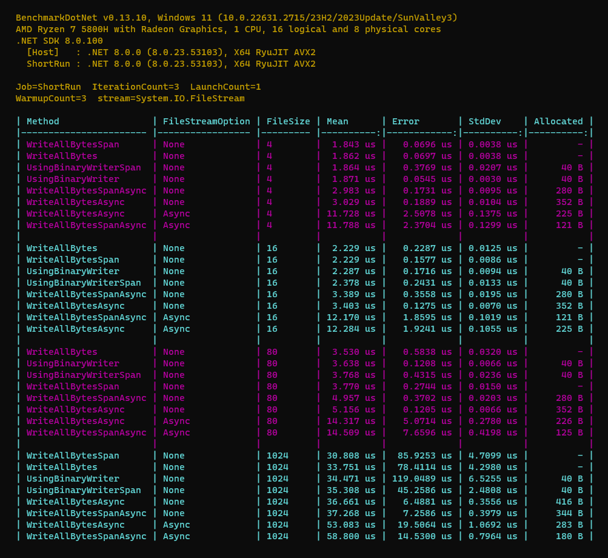

# Different ways to Write byte[] to Stream

## Key Results

1. `Span`, `ReadOnlySpan`, and `byte[]` do not have any difference in performance speed and memory allocation for **Sync** methods
2. But for **Async** methods, the `Memory` and `ReadOnlyMemory` ones has better performance and less allocation
3. Both `WriteAllBytes` and `UsingBinaryReader` are **the best** and have **similar performance and allocation**
4. `WriteAllBytes` **does support Async** by `RWriteAllBytesAsync` (but `UsingBinaryReader` **does NOT**)
5. `Async` methods with `FileOptions.None | Sequential` are **faster** than `FileOptions.Asynchronous`

