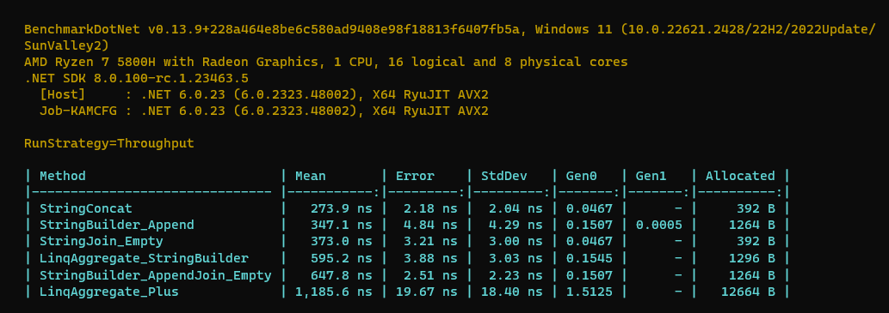

# Different methods to Concact a string[]

## Key Results

**Fastest** and **Most CG Efficient**  Methods are 👇

```cs
public static string Concat(string[] arr)
{
    var builder = StringBuilderCache.Acquire();
    for (int i = 0; i < arr.Length; i++)
        builder.Append(arr[i]);
    return StringBuilderCache.GetStringAndRelease(builder);
}

//OR

string.Concat(arr);
```

