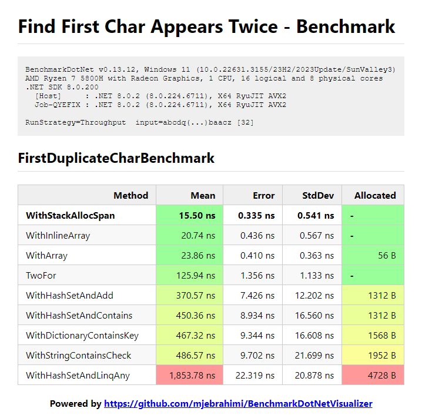

# Different ways to Find First Char Appears Twice

- Find first char that appears twice in a given string.
- All character are the English lowercase.

## Key Results

- Regular arrays are allocated on **Heap** but Both `Span<bool> span = stackalloc bool[26];` and `var arr = new InlineArray26<bool>();` allocate on **Stack**.  (InlineArray is introduced in.NET 8.0)
- Stack arrays are **Faster** than Heap arrays and have **no pressure/overhead on GC** (since they are zero-allocation)
- The `stackalloc Span` is **Faster** than `InlineArray` (IMO: InlineArray has **no advantages** over stackalloc Span)

