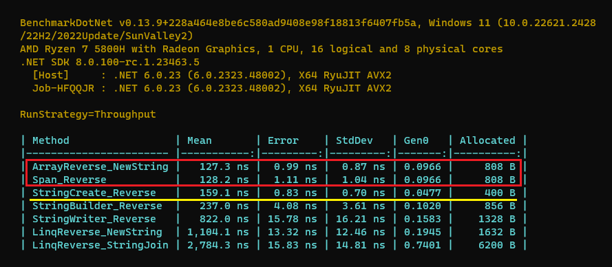

# Different methods to Reverse a string

**Result: Fastest Method is 👇**

```cs
public static string Reverse(string input)
{
    char[] charArray = input.ToCharArray();
    Array.Reverse(charArray);
    return new string(charArray);
}
```

