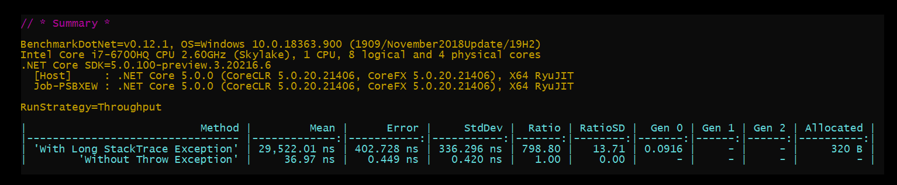

# Throw Exception Benchmarks

A benchmark comparison between:

- A normal flow operation
- Above operation with a long stack trace exception (17 inner calls of methods - string length of stacktrace : 3,458 - size of stacktrace  : 768 bytes)

### Result:

- **In my test, throwing Exception was about 800 times slower than without exception.**

- **Each exception takes 29,522 ns.**

- **Therefore, 33,873 exceptions are required to slow down one second of the server time (with my machine config).**

Nanosecond (ns) : One billionth of a second, that is, ​¹⁄₁ ₀₀₀ ₀₀₀ ₀₀₀ of a second, or 10⁻⁹ seconds.

Don't forget to run benchmarks in **Release mode** and **Start without Debugging.**
