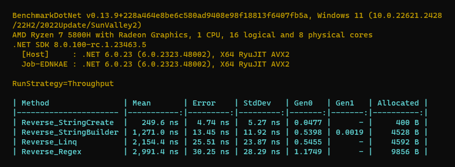

# Different methods to reverse words in a text except delimiters (space, dot, comma)

## Key Results: 
**Fastest and Most GC efficient Method is 👇**

```cs
public static string ReverseWords(string input)
{
    if (string.IsNullOrEmpty(input))
        return input;

    return string.Create(input.Length, input, (chars, state) =>
    {
        int reverseLength = 0;
        var length = chars.Length;
        for (int i = 0; i < length; i++)
        {
            var ch = state[i];
            if (ch == ' ' || ch == ',' || ch == '.')
            {
                if (reverseLength > 0)
                    chars.Slice(i - reverseLength, reverseLength).Reverse();
                reverseLength = 0;
            }
            else
            {
                reverseLength++;
            }
            chars[i] = ch;
        }
        if (reverseLength > 0)
        {
            chars.Slice(length - reverseLength, reverseLength).Reverse();
        }
    });
}
```

